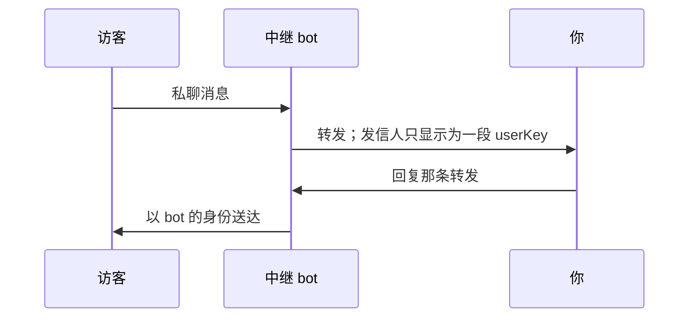

# tg-relay-bot

[](LICENSE)
[](https://github.com/Lynthar/tg-relay-bot/actions/workflows/ci.yml)

注重隐私的多租户 Telegram 消息中继 bot：一套代码，可部署为 Cloudflare Worker 或 Docker 容器

简体中文 | [English](README.en.md)

陌生人给你的 bot 发私聊，消息转到你自己的 Telegram 里；你直接回复那条转发，对方就收到
了——发信人显示成 bot，你的账号自始至终没露出去。



我在上游基础上改动最大的一处，是**让一次部署能托管很多个 bot**。你自己的，加上你邀请
的朋友的，彼此完全隔离。朋友不用碰服务器，也不用找你要什么密钥：在一个「管家 bot」
里发 `/setup`，把自己的 token 贴进去就可以了。

## 安装

两种部署方式都完整支持，CI 里两种都跑。共同的前置是找 [@BotFather](https://t.me/BotFather)
建一个**管家 bot**（跟中继 bot 分开），以及知道自己的 Telegram UID。

**Cloudflare Worker**——需要 Cloudflare 账号和 Node 20+：

```bash
git clone https://github.com/Lynthar/tg-relay-bot.git
cd tg-relay-bot
npm install
npx wrangler login
npx wrangler kv namespace create nfd
```

把返回的 id 填进 `wrangler.toml`（**仓库里那个现成的 id 是别人的，必须换掉**），
在 `[vars]` 里设 `ENV_PUBLIC_BASE_URL`，然后：

```bash
npx wrangler secret put ENV_MANAGER_BOT_TOKEN
npx wrangler secret put ENV_HOST_UID
npx wrangler secret put ENV_MASTER_ENC_KEY
npx wrangler secret put ENV_ADMIN_SECRET
npx wrangler deploy
```

**Docker**——需要一个能签 HTTPS 证书的域名（Telegram 的 webhook 只收 HTTPS）：

```bash
git clone https://github.com/Lynthar/tg-relay-bot.git
cd tg-relay-bot
cp .env.example .env
docker compose up -d
```

反代把 TLS 卸载后转到 `127.0.0.1:8080`。两种部署方式最后都要注册一次 webhook：

```bash
curl "https://<你的域名>/admin/registerWebhook?s=<ENV_ADMIN_SECRET>"
```

## 用法

朋友要用起来，最短的流程是：找管家 bot 发 `/whoami` 拿到自己的 UID → 告诉你 → 你发
`/invite <uid>` → 他去 BotFather 建 bot → 回管家 bot 发 `/setup` 贴 token → 完成。
每个 UID 最多 3 个 bot，webhook 自动注册。

管家 bot 里，所有人可用：`/start` `/help` `/whoami` `/setup` `/list` `/cancel`。

bot 主人管自己的 bot：

```
/info <bot_username>
/displaymode <bot_username> <native|tag|hex>
/admins <bot_username> [add|remove <uid> | list]
/start_message <bot_username> <文案>
/pause <bot_username>   /resume <bot_username>
/delete <bot_username> --yes
```

host 另有 `/invite` `/uninvite` `/invites` `/host_list` `/host_disable`
`/host_purge` `/host_migrate`。

在中继 bot 那边，`/block` `/unblock` `/checkblock` 必须**回复某条转发消息**才生效。
相册、转发、各类媒体走同一套处理逻辑；访客限速默认 60 秒 5 条（相册整组算一条），
update 去重，每 bot 最多 10 个管理员。

## 配置

Worker 侧用 `wrangler secret put` 加 `wrangler.toml` 的 `[vars]`；Docker 侧用 `.env`。
逐租户的设置不在这里，存在 KV 或 SQLite 里。

| 变量 | 说明 |
|---|---|
| `ENV_MANAGER_BOT_TOKEN` | 管家 bot 的 token，**跟中继 bot 是两个** |
| `ENV_HOST_UID` | 你自己的 Telegram UID |
| `ENV_MASTER_ENC_KEY` | base64 的 32 字节 AES 密钥。**定了就不能改**，改了所有租户 token 都解不开 |
| `ENV_PUBLIC_BASE_URL` | 必填，必须 `https://` 开头，所有 webhook 地址由它拼出来 |
| `ENV_ADMIN_SECRET` | 守 `/admin/*`；不设的话那些端点一律 404 |
| `PORT` / `DATA_DIR` | 只有 Node 那种部署读，默认 8080 与 `/data` |

生成密钥：`openssl rand -base64 32` 和 `openssl rand -hex 32`。

## 安全与边界

- **不是端到端加密**，Telegram 本身就做不到。host 手上有解开所有租户 token 的能力——
  这套东西**不适合放在你不信任的人那里托管**。
- **匿名保护的对象是访客，不是运营者。** 开 `ENV_DEBUG=1` 时事件日志会记 owner 和
  管理员的 UID；访客永远只以 userKey 出现。
- **`ENV_MASTER_ENC_KEY` 是唯一的根密钥，丢了无法恢复**：所有租户得重新 `/setup`，
  没有第二道灾备。
- **两种部署方式之间不能迁移数据。** 换一种等于每个人重新配置一次，黑名单会丢。
- **只处理私聊消息。** 群组、频道、消息编辑、按钮回调一概不处理。
- **没有命令菜单也没有按钮**，bot 用户名、UID、32 位 userKey 都要手动输入。

存储侧：访客的 chatId 不落库，落的是每租户独立密钥算出来的 `HMAC-SHA256` 截断 16 字节；
租户的 bot token 与 webhook secret 用 AES-256-GCM 静态加密；密钥比较走常数时间。
174 个测试用例，主套件跑纯 Node，另有 5 个冒烟跑真 workerd。

## 与上游的区别

上游是 [LloydAsp/nfd](https://github.com/LloydAsp/nfd)——单租户、单文件 Worker，每个
bot 的配置都在环境变量里，加一个 bot 就要改一次 Cloudflare 配置。我用 TypeScript 把它
重写成多租户服务：配置搬进存储层，凭据静态加密，加了邀请制、限速、去重、SQLite 后端
和 Docker 部署。我还删掉了上游的 UID 反诈名单——那是社区场景的需求，个人小规模自用
时它只是一条对外网的运行时依赖。

## 文档

- [用户指南](docs/user-guide.md) —— 部署、日常使用、常见问题。
  [English](docs/user-guide.en.md) 同步维护。

## 许可证

GNU 通用公共许可证 v3.0 —— 见 [LICENSE](LICENSE)。继承自上游
[LloydAsp/nfd](https://github.com/LloydAsp/nfd)，同为 GPL-3.0。
